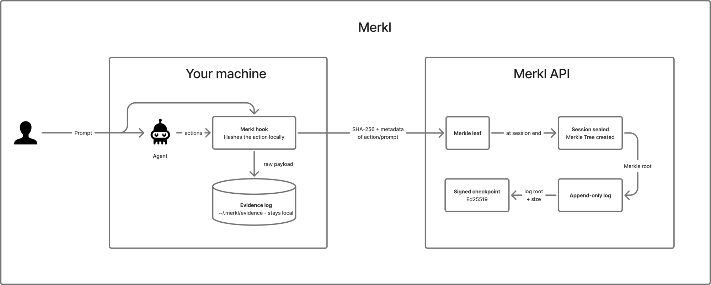
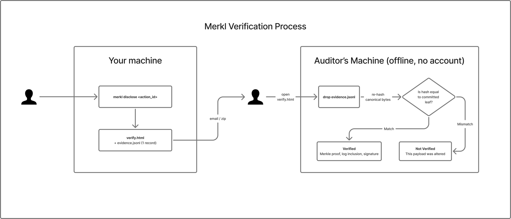

# merkl-sdk

Tamper-evident audit trails for AI agents. Merkl records every action an agent takes, hashes it into a Merkle tree, and commits the roots to a signed transparency log — while raw payloads stay on **your** machine. Anyone can later verify what happened, in the browser, without trusting anyone's word.

## Install (Claude Code)

```bash
pip install merkl-sdk
merkl install --claude-code --global
export MERKL_API_KEY=mk_...        # from your Merkl dashboard
```

That's it. Every session now records: tool calls, your prompts, permission decisions, and a hash of the full transcript at exit — each as a Merkle leaf.

## How it works



The hook hashes locally and sends **only the hash**; the raw payload stays in your evidence log. Sealing a session pins its Merkle root into an append-only, signed transparency log — after that, nobody (including Merkl) can alter or reorder the history without breaking the math.

## What leaves your machine (and what doesn't)

By default the notary receives **only tool names, typed metadata, and SHA-256 hashes**. The raw payloads — commands, file contents, prompts — go to a local, append-only evidence log:

```
~/.merkl/evidence/<session>.jsonl     # yours; never uploaded
```

- `MERKL_INCLUDE_PREVIEWS=1` — opt in to sending truncated plaintext previews
- `MERKL_EVIDENCE_DIR=off` — disable local evidence capture
- `MERKL_AGENT_ID`, `MERKL_ENDPOINT` — label your agent, point at your instance

## When it matters

Someone disputes what your agent did:

```bash
merkl disclose <action_id>
# → disclosure-<id>/
#     verify.html      standalone verifier with the session's proofs
#     evidence.jsonl   only the disclosed action's raw record
```

Send the folder. The auditor opens `verify.html` in any browser — no install, no network, no account — drops the evidence on it, and every record is re-hashed against the Merkle leaves committed at execution time. A record altered after the fact fails, mathematically.



The proof was committed *at execution time*; the disclosure happens later. That ordering is the whole point — the operator cannot retro-fit a record to a dispute, and the auditor never has to trust Merkl, the operator, or the network.

## Python SDK

```python
from merkl.sdk import MerklClient

client = MerklClient(endpoint="https://api.merkl.ai", agent_id="my-agent", api_key="mk_...")
async with client.session(goal="Process refunds", allowed_tools=["query_db"]) as session:
    await session.record_action(tool_name="query_db", input_data="SELECT ...", output_data={...})
# session seals on exit: Merkle root pinned, committed to the transparency log
```

Framework adapters for LangChain, OpenAI, CrewAI, and Google ADK ship as experimental (`merkl.integrations.*`).

## How verification works

```
action ──sha256──▶ leaf ──▶ session root ──▶ transparency log ──▶ Ed25519-signed checkpoint
```

Sessions resumed after a seal chain cryptographically to their parent (leaf 0 binds the parent's root). The transparency log is an RFC 6962 Merkle tree; auditors pin signed checkpoints and any rewrite of history breaks the consistency proof. All algorithms are public standards: SHA-256, RFC 6962/9162, Ed25519.

## Development

```bash
pip install -e ".[dev]"
pytest   # 137 tests
```
